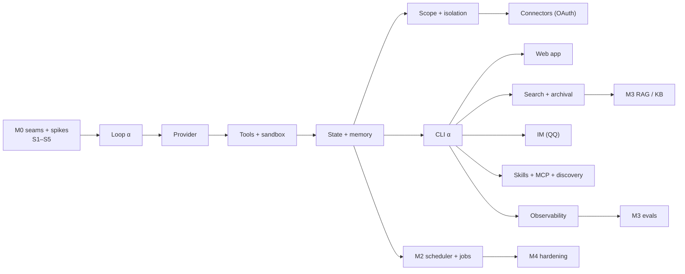

# Keel — Implementation Plan

> **Status:** Draft v1.0 · **Date:** 2026-07-06 · **Maps to:** PRD §11 milestones, ARCHITECTURE §19 · **Inputs:** [`DESIGN-REVIEW.md`](./DESIGN-REVIEW.md)
> A phased, milestone-aligned plan of record. **No code in this document** — it sequences the work, fixes exit criteria, and names the gating acceptance tests. Deliverables map to the PRD's M0–M4.

---

## 1. Strategy

1. **Contract-first.** Freeze `keel-core` Protocols (Tool, EventStore, ProviderGateway, PermissionEngine, PromptAssembler, AgentSpec, **ScopeGuard** [ADR-0009]) and the **event vocabulary + REST schema** before implementing behind them. Surfaces consume a generated SDK.
2. **Thin vertical slice, then breadth [P2].** M1 first lights up **one** path end-to-end (CLI → server → worker → `keel-core.run` → provider → file/shell tool → events → session), then adds web, IM, search, skills, MCP around the proven spine.
3. **Footprint ladder [P8].** Every new capability enters as a skill/tool/plugin/MCP before it may touch the core.
4. **Risk-first spikes.** The five correctness-critical mechanisms are proven in M0 with acceptance tests, not discovered in M2.
5. **Invariants are gates.** The acceptance tests in `DESIGN-REVIEW.md §5` are **merge-blocking** for the milestone that introduces each invariant.

---

## 2. Workstreams

| WS | Stream | Owns (packages/modules) |
|---|---|---|
| **A** | Agent runtime | `keel-core/loop`, `context` |
| **B** | Providers | `keel-core/providers` (LiteLLM gateway) |
| **C** | Tools & sandbox | `keel-core/tools`, `keel-sandbox` |
| **D** | State, memory, search | `keel-core/state`, `memory`; migrations |
| **E** | Surfaces | `keel-cli`, `web/`, `adapters/` |
| **F** | Autonomy | `keel-scheduler`, `keel-worker` (jobs) |
| **G** | Extensibility | `keel-core/skills`, `mcp`, `discovery`; `keel-sdk`, plugins |
| **H** | Observability | `keel-core/observability`; Langfuse/OTel wiring |
| **I** | Platform | uv workspace, CI, compose, config, first-run bootstrap |
| **J** | Security | `keel-core/permissions`, approvals, secrets, trust-gating |

---

## 3. Milestones

### M0 — Foundations
**Goal:** an empty but real system that boots, streams one lifecycle event end-to-end, and has the seams + CI to build against.

- **I:** uv monorepo skeleton (ARCHITECTURE §15.2); `dev` compose boots `keel-server` + `keel-worker` + web stub + Postgres + Redis with green health/readiness; Alembic baseline migration; layered config (Pydantic Settings).
- **A/B/C/D/J:** public **Protocols/typed stubs** only — no behaviour — for the seams above; **event vocabulary v0** and **REST/OpenAPI v0** frozen; SDK generated in CI.
- **D/J [ADR-0009]:** freeze **`scope_id`** as a mandatory dimension on the data model and the **`ScopeGuard`** repository seam (every scoped read/write routes through it) — contract, not behaviour, but it must exist *before* any scoped table lands (retrofitting isolation is expensive — DESIGN-REVIEW G16).
- **H:** structured logging + OTel bootstrap; trace context propagates server→worker.
- **CI:** ruff + mypy + unit + image build; **provider record/replay** harness skeleton.
- **Spikes (each with a passing acceptance test):**
  - **S1** byte-stable prompt prefix → stable `prompt_cache_key` across turns/agents.
  - **S2** at-most-once scheduler (advance cursor before enqueue; crash → 0/1 runs).
  - **S3** sandbox egress-deny + path allow-list (`.git`/`.env`/loopback blocked).
  - **S4** SSE/WS event fan-out via Redis pub/sub (replayable `after=`).
  - **S5 [ADR-0009]** per-scope isolation: two scopes in one DB via the `ScopeGuard` layer + Postgres RLS; a cross-scope read is **denied and audited** (proves DESIGN-REVIEW G16 / the new §5 invariant before connectors land).

**Exit:** `docker compose --profile dev up` healthy; a no-op agent emits `run.started … run.ended{reason=completed}` visible over SSE; CI green; five spikes proven.

### M1 — MVP: "the core that talks"
Ordered so each sub-phase leaves a testable, usable increment.

1. **Loop α (A/D/J):** outer+inner loops, **stop-reason gate**, **durable admission**, budgets, guardrails, **named termination**. → invariant tests (bounded loop, persist-before-call, gate).
2. **Provider (B):** `ProviderGateway` over LiteLLM; streaming normalization; **one provider live** + record/replay; cache-key wiring.
3. **Tools α (C/J):** `read/write/edit/ls/glob/grep` + `bash`/`pwsh` in **keel-sandbox**; permission gate; async parallel-safe executor; output bounding + spill. → sandbox + deterministic-order tests.
4. **State/memory + scope isolation (D/J) [ADR-0009]:** event store + projectors (`messages`/`parts`); **core memory blocks** (+versioning); session persistence + resume; **`scope_id` on every scoped table**, all access routed through the **`ScopeGuard`** layer (+ Postgres RLS) with cross-scope **deny + audit**. → invariant tests (resume with **0 lost turns**; **per-scope isolation**).
5. **CLI α (E):** streaming TUI + approvals + `/slash` + one-shot/headless. *(first fully usable path)*
6. **Search + archival (D):** hybrid FTS (`tsvector`+`pg_trgm` CJK) + pgvector KNN + RRF; **embeddings per ADR-0007** with `(model,dim)` pinning; `session_search` + `archival_search`.
7. **Web app (E):** chat streaming, tool/step timeline, approvals, session list & search, basic admin.
8. **IM (E/J):** OneBot(QQ) adapter; `platform:type:id` session keys; wake rules + per-chat rate limit; **untrusted → safe toolset**.
9. **Connectors (G/J) [ADR-0009]:** OAuth connector framework — token store **envelope-encrypted per `(scope, connector)`**, least-scope grants, fail-closed refresh/revoke; first connectors (email/calendar/docs) surfaced as **scope-bound tools** with **taint-tagging** of external content; outbound actions **approval-gated + idempotent**. → **confused-deputy test** (tainted email/web content cannot trigger an unapproved outbound / cross-connector action).
10. **Extensibility (G):** skills loader (progressive disclosure), MCP client (stdio+HTTP/SSE, allow-list), `tool_search` discovery.
11. **Observability (H):** Langfuse trace→observation→score; cost/token accounting (incl. cache-read).

**Exit (KPIs):** internal **task-suite ≥ 80%**; invariant acceptance suite green (incl. **per-scope isolation** and the **confused-deputy** outbound guard); `full` profile up in one command; a new SDK tool **and** a new MCP server each added in **< 30 min**; 100% of runs traced with cost.

### M2 — Autonomy & scale
Scheduler service + **background jobs** (progress/cancel/result-injection) + **worker scale-out** + provider **failover/routing** + admin dashboards + **RBAC** + Telegram & WeCom adapters. Land **G5 durable/fail-closed approvals**, **G7 cost reconciliation**, **G10 rate limits**.
**Exit:** at-most-once holds under induced crashes; N-worker horizontal scaling demonstrated; per-task model routing live.

### M3 — Knowledge & quality
RAG/KB (ingest→chunk→embed→hybrid retrieve, retrieval-as-tool) + **memory consolidation** (constrained agent) + **evals/datasets** (Langfuse) + **plugin SDK** + hooks + **Tauri** desktop shell. Harden **G3 event upcasters**, **G4 retention/erasure**.
**Exit:** eval harness runs on datasets with scores; plugin hot-load with manifest validation + rollback.

### M4 — Hardening
Security review (**G6** injection scan, **G9** secret envelope-encryption/KMS, sandbox strict modes), performance (NFR-2 targets), multi-tenant groundwork, **backup/DR runbook (G15)**, docs & examples.
**Exit:** security test-suite **0 sandbox escapes**; perf p50 targets met; restore drill passes in e2e.

---

## 4. Dependency / critical path

Critical path to a usable product: **seams → loop → provider → tools/sandbox → state → CLI**. Everything after CLI parallelises across teams.

---

## 5. Testing & Definition of Done

- **Determinism:** provider **record/replay** for all core tests; golden **event-stream** snapshots.
- **Layers:** unit (`keel-core`) · integration (services + Postgres/Redis via testcontainers) · e2e (compose task-suite) · eval (Langfuse datasets).
- **Invariant gates:** the ten acceptance tests in `DESIGN-REVIEW.md §5` block merges for their milestone.
- **DoD (per change):** typed + `mypy` clean; unit/integration tests; **traced**; documented; behind config/flags; **no secret in image**; runs on both `lite` and `full` where applicable (ADR-0008).

---

## 6. First two weeks (plan of record)

1. **Freeze the contracts** — event vocabulary + `keel-core` Protocol signatures + REST v0, **including `scope_id` + the `ScopeGuard` seam** [ADR-0009] (one review).
2. **Stand up** compose `dev` + CI skeleton (lint/type/unit/build + record-replay stub).
3. **Land spikes S1–S5** with acceptance tests.
4. **Write invariant acceptance-test specs** (from DESIGN-REVIEW §5) so M1 codes against them.

*(Still design/setup only — no product code — matching the current phase.)*
