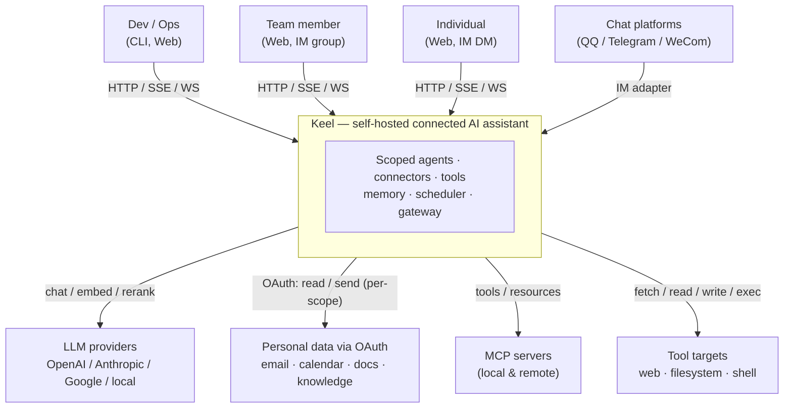

# 01 — System context (C4 level 1)

Who talks to Keel, and what Keel talks to. Keel's primary form is a **server-side connected assistant** for teams/IM and individuals; personal data is reached via **per-scope OAuth connectors**.

