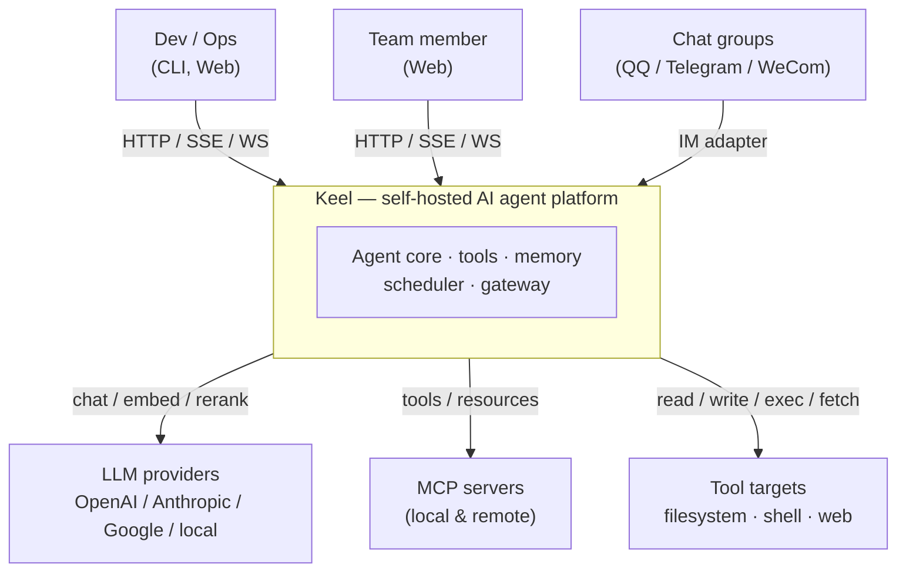

# 01 — System context (C4 level 1)

Who talks to Keel, and what Keel talks to.

```mermaid
flowchart TB
    dev["Dev / Ops<br/>(CLI, Web)"]
    team["Team member<br/>(Web)"]
    chat["Chat groups<br/>(QQ / Telegram / WeCom)"]

    subgraph keelSys["Keel — self-hosted AI agent platform"]
        core["Agent core · tools · memory<br/>scheduler · gateway"]
    end

    llm["LLM providers<br/>OpenAI / Anthropic / Google / local"]
    mcp["MCP servers<br/>(local & remote)"]
    targets["Tool targets<br/>filesystem · shell · web"]

    dev -->|"HTTP / SSE / WS"| keelSys
    team -->|"HTTP / SSE / WS"| keelSys
    chat -->|"IM adapter"| keelSys
    keelSys -->|"chat / embed / rerank"| llm
    keelSys -->|"tools / resources"| mcp
    keelSys -->|"read / write / exec / fetch"| targets
```
