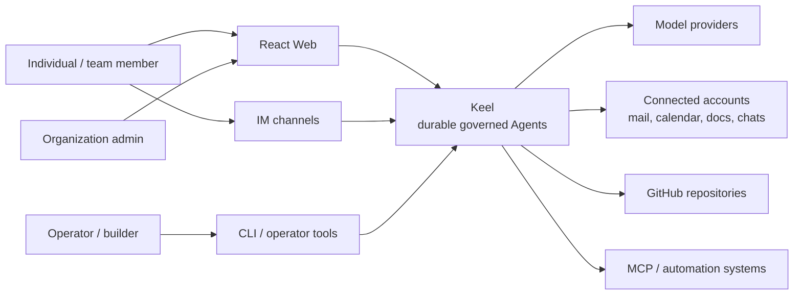

# System context

```mermaid
flowchart LR
    USER["Individual / team member"]
    ADMIN["Organization admin"]
    OP["Operator / builder"]

    WEB["React Web"]
    IM["IM channels"]
    CLI["CLI / operator tools"]
    KEEL["Keel<br/>durable governed Agents"]

    LLM["Model providers"]
    CLOUD["Connected accounts<br/>mail, calendar, docs, chats"]
    GITHUB["GitHub repositories"]
    MCP["MCP / automation systems"]

    USER --> WEB
    USER --> IM
    ADMIN --> WEB
    OP --> CLI

    WEB --> KEEL
    IM --> KEEL
    CLI --> KEEL

    KEEL --> LLM
    KEEL --> CLOUD
    KEEL --> GITHUB
    KEEL --> MCP
```

Keel's primary product is a connected personal/team Agent platform. Managed code review and patch
proposals are optional governed capabilities inside the same boundary.
