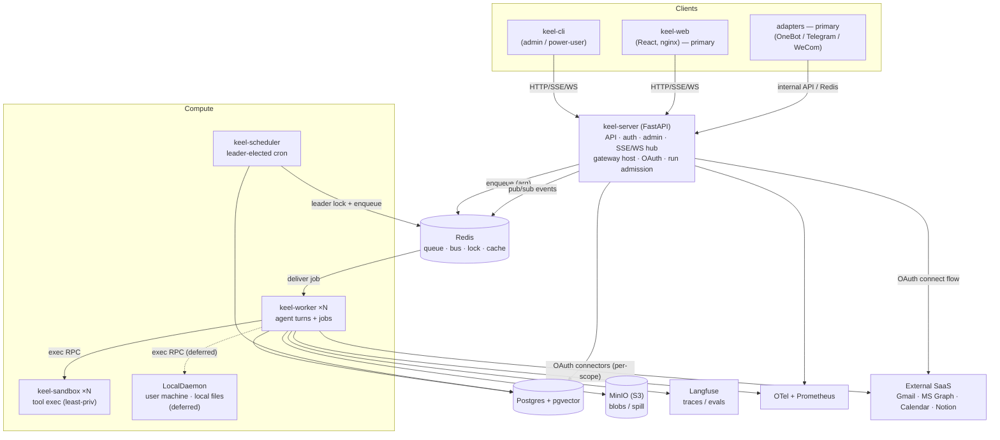

# 02 — Containers (C4 level 2)

Deployable units and their runtime dependencies. Every service imports `keel-core`; `keel-server` is stateless/scale-out, `keel-worker` scales horizontally, `keel-scheduler` is singleton-by-election. Tool execution is a **pluggable environment** (sandbox now; a user-machine `LocalDaemon` deferred). Connectors reach external SaaS over **per-scope OAuth**.

