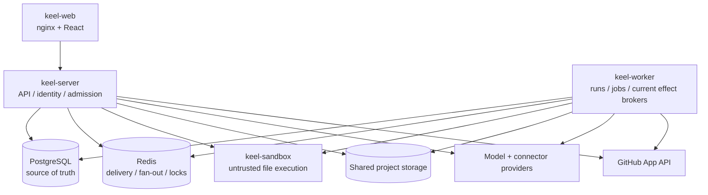

# Runtime topology

Current trust boundaries:

- server and worker are trusted control/orchestration processes;
- trusted connector/Git effect authority currently exists in both server routes and workers;
- sandbox is credential-less and untrusted;
- Postgres owns lifecycle state; Redis is not the sole durable record.

The production target separates orchestration workers from credentialed effect brokers.
