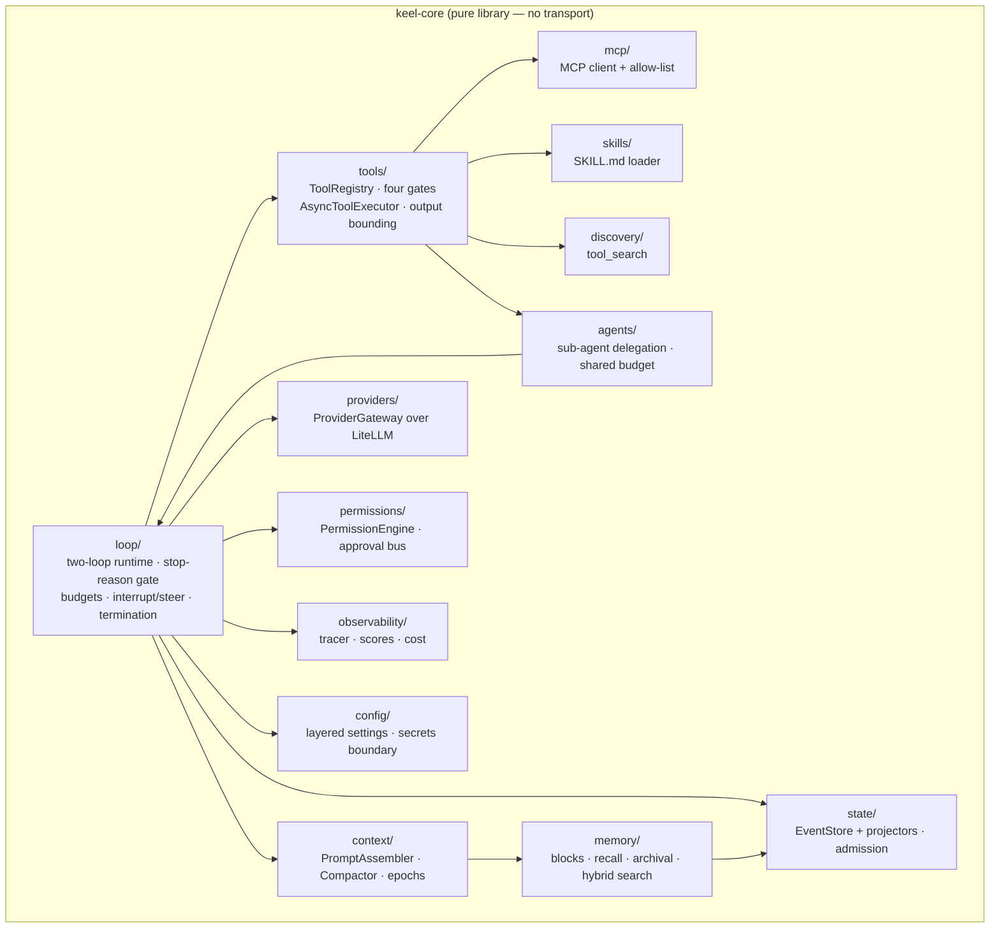

# 03 — `keel-core` components (C4 level 3)

The pure runtime library (no transport). The `loop` orchestrates; everything else is a seam.

```mermaid
flowchart TB
    subgraph core["keel-core (pure library — no transport)"]
        loop["loop/<br/>two-loop runtime · stop-reason gate<br/>budgets · interrupt/steer · termination"]
        ctx["context/<br/>PromptAssembler · Compactor · epochs"]
        tools["tools/<br/>ToolRegistry · four gates<br/>AsyncToolExecutor · output bounding"]
        prov["providers/<br/>ProviderGateway over LiteLLM"]
        mem["memory/<br/>blocks · recall · archival · hybrid search"]
        state["state/<br/>EventStore + projectors · admission"]
        agents["agents/<br/>sub-agent delegation · shared budget"]
        skills["skills/<br/>SKILL.md loader"]
        mcp["mcp/<br/>MCP client + allow-list"]
        disc["discovery/<br/>tool_search"]
        perm["permissions/<br/>PermissionEngine · approval bus"]
        obs["observability/<br/>tracer · scores · cost"]
        cfg["config/<br/>layered settings · secrets boundary"]
    end

    loop --> ctx
    loop --> tools
    loop --> prov
    loop --> state
    loop --> perm
    loop --> obs
    loop --> cfg
    tools --> mcp
    tools --> skills
    tools --> disc
    tools --> agents
    ctx --> mem
    mem --> state
    agents --> loop
```
