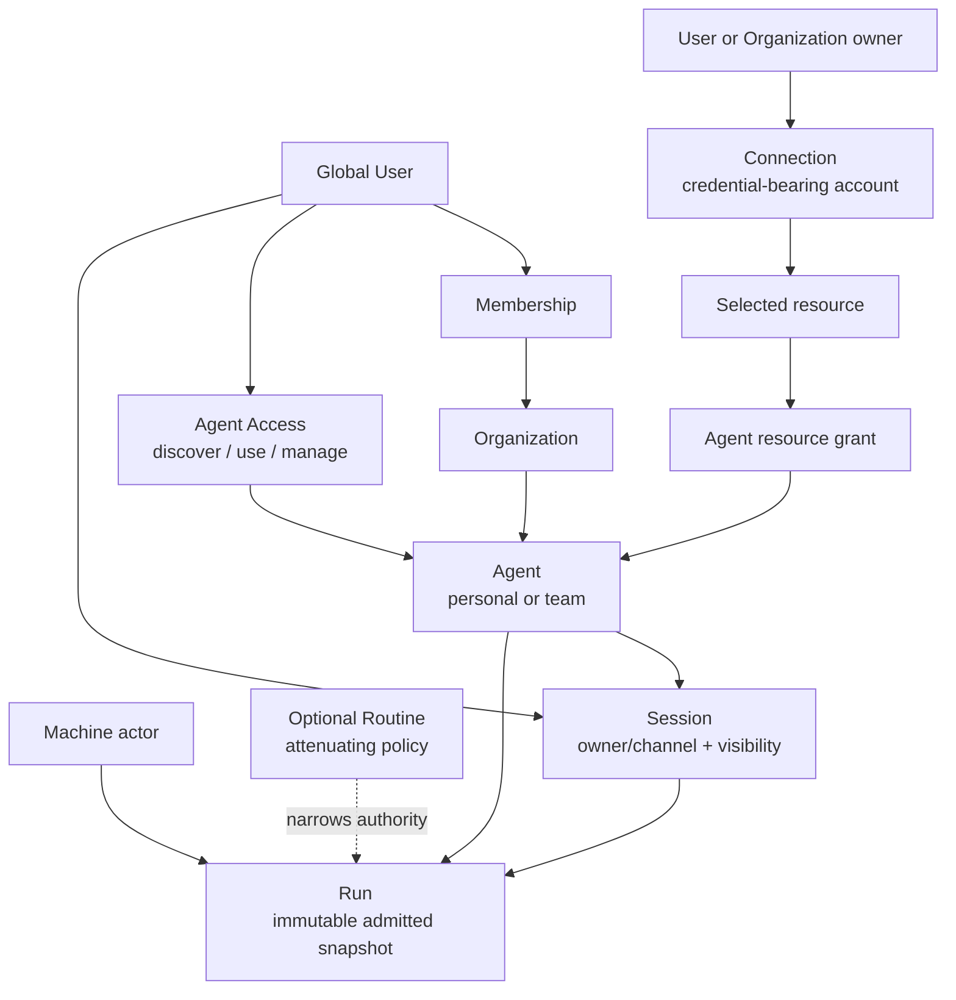

# Target domain and authority

Effective authority is the intersection of actor membership, Agent Access, Agent grants, Routine
policy, resource state, and deployment capability. `scope_id` is only the derived storage
partition. Agent Access, Connection, Routine, and explicit Session visibility are target entities;
the current implementation contains partial precursors.
