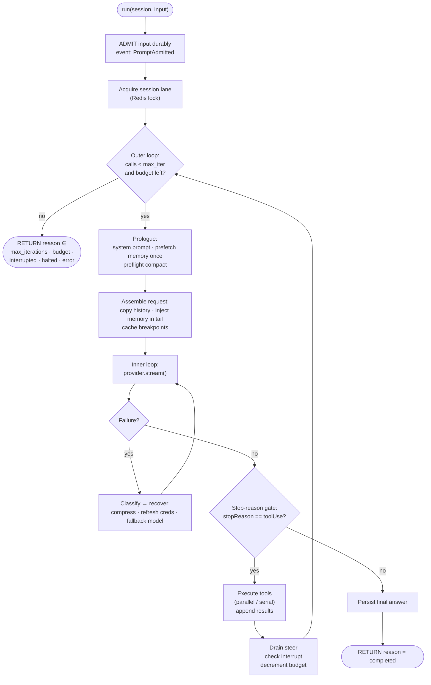

# 04 — Agent runtime: turn lifecycle

The two-loop core: an outer tool loop and an inner retry/failover loop, gated on the model's stop reason, terminating for a named reason.

```mermaid
flowchart TB
    start(["run(session, input)"]) --> admit["ADMIT input durably<br/>event: PromptAdmitted"]
    admit --> lane["Acquire session lane<br/>(Redis lock)"]
    lane --> outer{"Outer loop:<br/>calls &lt; max_iter<br/>and budget left?"}
    outer -->|no| done(["RETURN reason ∈<br/>max_iterations · budget ·<br/>interrupted · halted · error"])
    outer -->|yes| prologue["Prologue:<br/>system prompt · prefetch memory once<br/>preflight compact"]
    prologue --> assemble["Assemble request:<br/>copy history · inject memory in tail<br/>cache breakpoints"]
    assemble --> inner["Inner loop:<br/>provider.stream()"]
    inner --> fail{"Failure?"}
    fail -->|yes| recover["Classify → recover:<br/>compress · refresh creds · fallback model"]
    recover --> inner
    fail -->|no| gate{"Stop-reason gate:<br/>stopReason == toolUse?"}
    gate -->|yes| exec["Execute tools<br/>(parallel / serial)<br/>append results"]
    exec --> drain["Drain steer<br/>check interrupt<br/>decrement budget"]
    drain --> outer
    gate -->|no| persist["Persist final answer"]
    persist --> completed(["RETURN reason = completed"])
```
