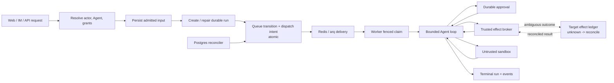

# Durable run and effect lifecycle

Admission is staged and idempotently repairable; the queued transition and dispatch intent share
the critical atomic boundary. Duplicate delivery is fenced by durable state. The `unknown` effect
ledger is the target generic contract; current providers implement differing reconciliation
strength. Approval binds the exact effect or immutable patch revision.
