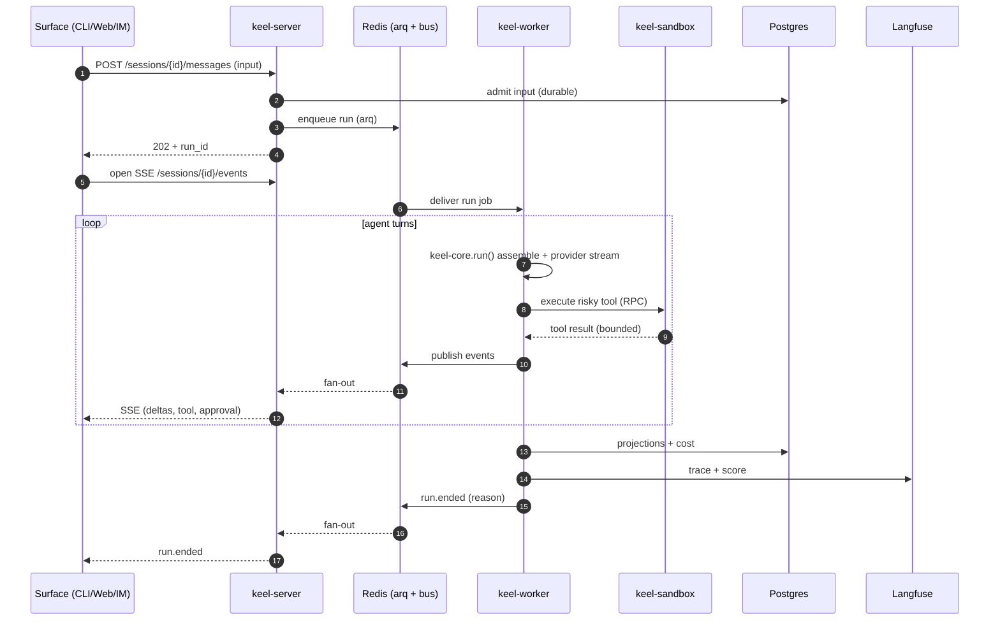
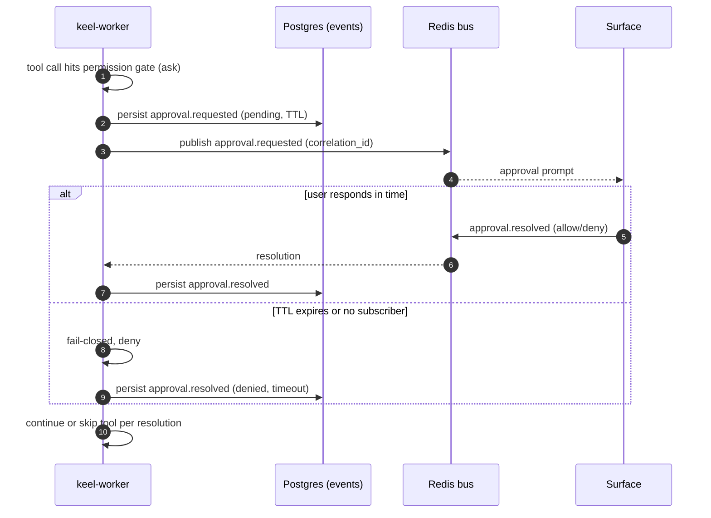
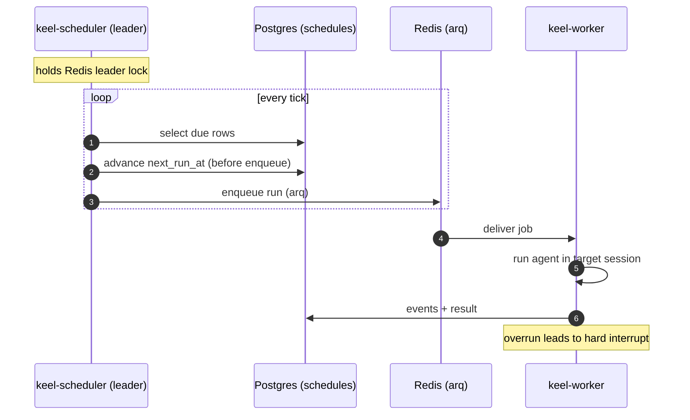
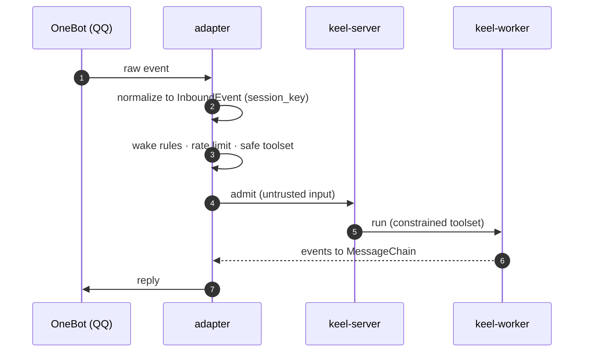

# 05 — Key sequences

## A. Interactive run (any surface)

## B. Approval round-trip (durable, fail-closed — DESIGN-REVIEW G5)

## C. Scheduled job (at-most-once)

## D. IM message (QQ / OneBot)

