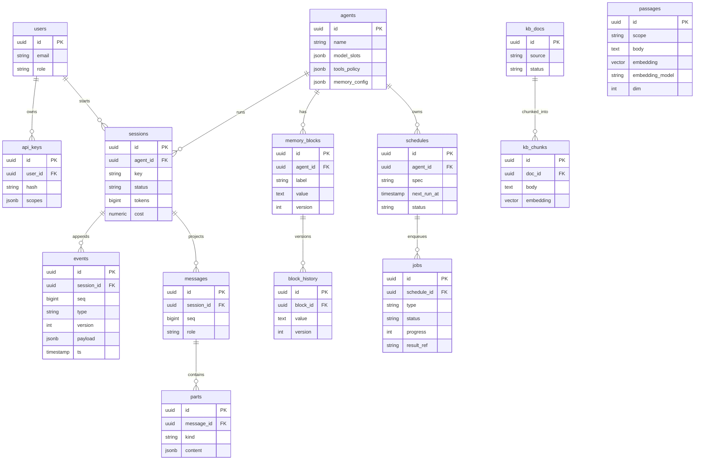

# 06 — Data model (core tables)

Abbreviated Postgres schema. `events` is the append-only source of truth; `messages`/`parts` are projections. Additions from `DESIGN-REVIEW.md`: `events.version` (G3, schema evolution) and `passages.embedding_model`/`dim` (G8, model pinning).

