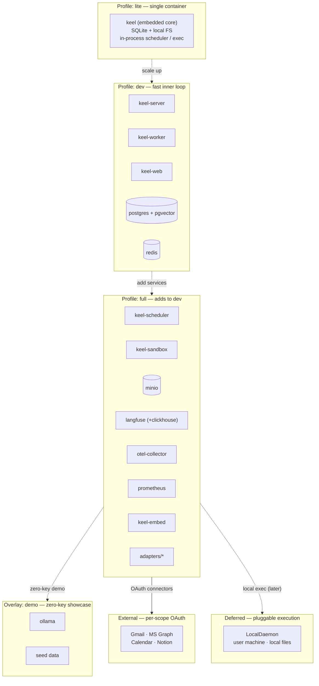

# 07 — Deployment profiles

Compose profiles from `ARCHITECTURE.md §15` and `ADR-0008`. Dashed edges show the footprint ladder from single-container `lite` up to `full`, plus the optional zero-key `demo` overlay.

