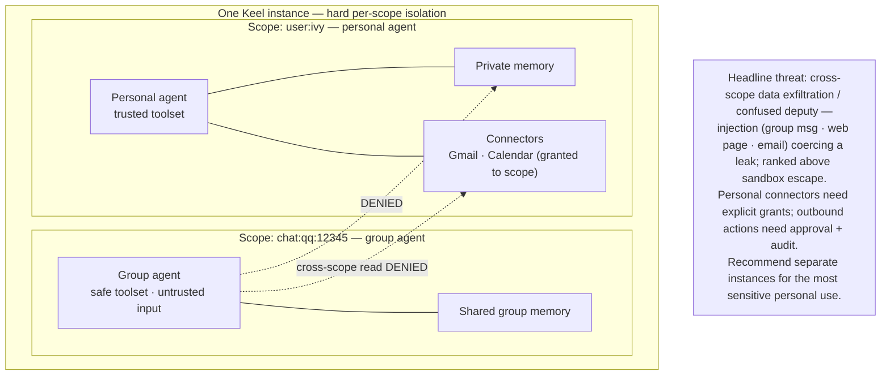
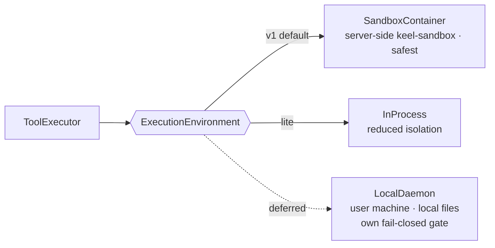

# 08 — Agent scope, connectors & isolation [ADR-0009]

The pivot's core idea: **an agent is a scoped, persisted entity.** A group agent and a personal agent are the *same* abstraction with a different scope; **per-scope isolation** keeps a group/untrusted agent away from a personal agent's connectors, memory, and tokens.

## Pluggable execution environment

*Where* a tool runs is a swappable backend, so "server vs personal-machine" is a backend choice, not an architecture fork.

